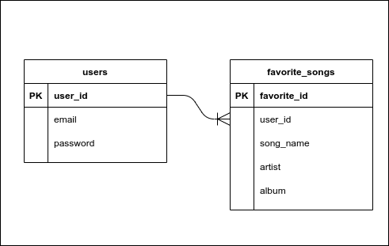

# ST IT Cloud -  Talent Song API Test


## Caso

Você é um desenvolvedor backend, e precisa construir uma feature nova para o serviço de streaming de música. Essa nova feature é para guardar as músicas favoritas dos usuários e facilitar o acesso.


Para isso, o sistema precisa de uma feature de autenticação também, pois os usuários precisam realizar o login para **cadastrar** as suas músicas. O usuário tem permissão de **visualizar** apenas as músicas que ele **cadastrou** como favorita. Esse usuário pode realizar a **alteração** ou a **deleção** da música, de sua lista de favoritos.


## Objetivo

Esse teste deve avaliar a qualidade técnica de construção de API's, manipulação com base de dados, otimização de performance, organização e tratamento de erros.

**obs**: Afim de reduzir a complexidade deste teste, a modelagem não necessita de uma listagem de todas as músicas, o usuário vai adicionar a música pelo nome na lista de favoritos.


O objetivo é o desenvolvimento de uma API de acordo com os seguintes requisitos:


## Requisitos 

A API deve expor os seguintes endpoints através de HTTP(S), e caso a API utilize uma porta que não seja as padrões do protocolo, deve ser informado na entrega do teste.

A API deve possuir alguma base relacional de preferencia para armazenamento dos dados. Essa base relacional deve atender a seguinte modelagem:




**obs**: Não é obrigatório o uso da **base relacional**. Pode ser utilizado **não relacional** também. Desde que entre no contexto do teste e seja bem justificado na entrega do projeto.

### **POST /login**

Esse endpoint deve receber os dados de autenticação e deve cruzar com os dados que foram cadastrados na base de dados, na tabela de "users". Caso a combinacão de usuário e senha existam na tabela, o endpoint retorna um token com o identificador do usuário via claims. Caso não exista, deve informar que o acesso não pode ser autorizado.

**Requisição esperada**

```
{  
  "email": `<USER_EMAIL>`, 
  "password": `<USER_PASSWORD>` 
}
```

**Resposta esperada**

```
{ 
  "token": `<JWT TOKEN>` 
}
```


### **POST /favorite-songs**

Esse endpoint deve receber os dados da música a qual deve ser cadastrado como favorita, pelo usuário autenticado. Os dados desse endpoint deve ser guardado na tabela "favorite_songs", e essas músicas que foram guardadas, devem ser vinculadas ao usuário no qual está cadastrando-as.


**Requisição esperada**
```
{ 
  "songName": `<SONG_NAME>`, 
  "artist": `<ARTIST>`, 
  "album": `<ALBUM>` 
}
``` 

**Resposta esperada**
``` 
{ 
  "favoriteId": `<FAVORITE_ID>`, 
  "songName": `<SONG_NAME>`, 
  "artist": `<ARTIST>`, 
  "album":`<ALBUM>` 
}
```


### **GET /favorite-songs**

Esse endpoint deve retornar as músicas que foram cadastradas como favoritas pelo usuário que está autenticado.

Este mesmo endpoint deve possui 3 filtros via query string, **que não devem ser obrigatório na requisição**, que são:

- Filtro pelo "artist"
- Filtro pelo "album"
- filtro pelo "songName"

**Requisição esperada**
- /favorite-songs
- /favorite-songs?artist=`<ARTIST>`
- /favorite-songs?album=`<ALBUM>`
- /favorite-songs?songName=`<SONG_NAME>`
- /favorite-songs?songName=`<SONG_NAME>`&album=`<ALBUM>`&artist=`<ARTIST>`


**Resposta esperada**
```
[
  { 
    "favoriteId": `<FAVORITE_ID>`, 
    "songName": `<SONG_NAME>`, 
    "artist": `<ARTIST>`, 
    "album":`<ALBUM>` 
  }
]
```


### **PUT /favorite-songs/:favoriteId**

Esse endpoint deve receber as informações da música que você queira realizar a alteração, e via query parameter deve receber o identificador da música favorita.

**Requisição esperada**
- /favorite-songs/`<FAVORITE_ID>`

**Resposta esperada**
```
{ 
  "songName": `<SONG_NAME>`, 
  "artist": `<ARTIST>`, 
  "album":`<ALBUM>` 
}
```

### **DELETE /favorite-songs/:favoriteId**
Esse endpoint deve receber o identificador da música favorita, para que possa realizar a deleção da lista de favoritos.

**Requisição esperada**
- /favorite-songs/`<FAVORITE_ID>`

## Requisitos não-funcionais

- A autenticacão do usuário deve ser feita através de alguma implementacão de JWT.

- Instruções para instalacão e execucão da API, incluindo as dependências de libs, runtimes, e etc.

- A API deve ser escalável horizontalmente.


## Bonus! (Não obrigatório)
- Implementacão de testes unitários.
- Execucão em container.
- Publicacão da API em algum servico cloud.

## Dicas

### Banco de dados

Para facilitar o desenvolvimento do teste, disponibilizamos nester repositório o docker compose configurado do mysql e postgres. Dois bancos relacionais muito utilizados para desenvolvimento.

Para levantar o serviço de ambos os bancos, é necessário possuir o docker e o docker compose instalado no seu computador. 
- <a href="https://docs.docker.com/get-docker/" title="Instalação do docker">Você pode instalar o Docker clicando aqui</a>
- <a href="https://docs.docker.com/compose/install/" title="Instalação do docker compose">Você pode instalar o Docker Compose clicando aqui</a>


Após esses programas instalados você pode executá-los assim:


Para MySQL
```
-- Subir o serviço 
docker-compose -f ./docker-compose-mysql.yml up -d

-- Derrubar o serviço
docker-compose -f ./docker-compose-mysql.yml down

Credenciais
user: root
password: mysql
database: mysql
```


Para Postgres
```
-- Subir o serviço 
docker-compose -f ./docker-compose-postgres.yml up -d

-- Derrubar o serviço
docker-compose -f ./docker-compose-postgres.yml down

Credenciais
user: root
password: postgres
database: postgres
```


**obs**: Lembrando que as dicas acima não são obrigatórias, mas são dicas para facilitar o desenvolvimento.

### Serviços de hospedagem

O Heroku é uma cloud de facil acesso que possui planos gratuitos, para hospedagem da sua aplicação ou de banco de dados.


## Critérios de Avaliacão

- Pontualidade da entrega
- Atendimento dos requisitos
- Aderência à stack solicitada
- Dados respondidos corretamente
- Uso correto dos códigos HTTP para casos de sucesso e erro
- Qualidade do código. Levaremos em consideracão a utilizacão de padrões de desenvolvimento como GoF Design Patterns, GRASP, DRY, KIS e SOLID. Também avaliaremos a clareza do código, e a quantidade de *code smells*.
- Argumentacão dos trade-offs e escolhas técnicas, como estruturacão do projeto, algoritmo para trabalhar com os dados e etc.


